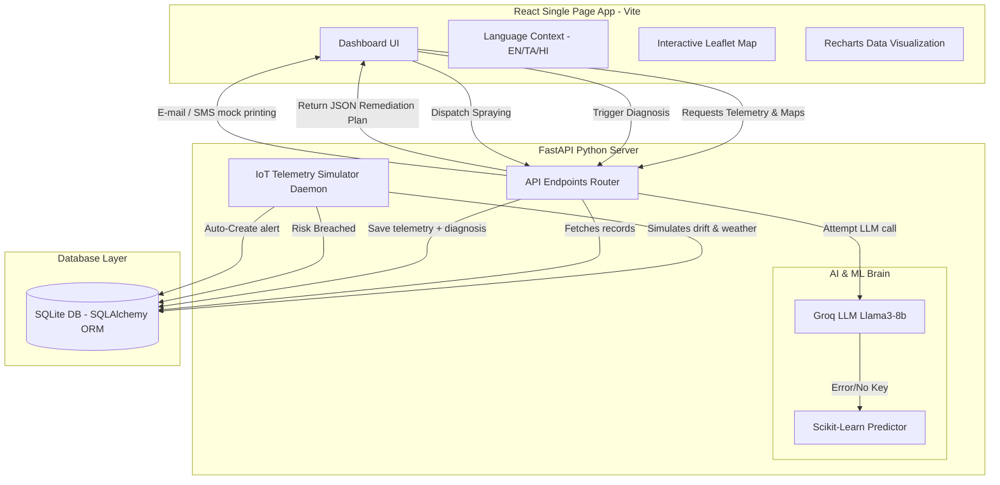

# 🌿 Mei Arivu — Smart Waste Intelligence Platform
### *Comprehensive Platform Architecture & Technical Stack Report*

---

## 1. Project Overview
**Mei Arivu** (meaning "True Knowledge" in Tamil) is an enterprise-grade, AI-powered **Bioremediation & Waste Intelligence Platform** specifically designed for **Madurai District, Tamil Nadu**. Developed under the **Mei Innovations** banner, the platform represents a smart-city initiative aimed at changing municipal organic waste management into a data-driven science. 

By integrating IoT telemetry logs, machine learning (ML), large language models (LLMs), and public health warning systems, Mei Arivu helps city operators:
1. **Optimize Composting**: Predict degradation timelines and prescribe biochemical corrective actions.
2. **Prevent Health Outbreaks**: Detect vector-borne breeding conditions (Dengue, Malaria, Leptospirosis) inside waste piles and automate public health emergency dispatches.
3. **Manage Supplies**: Seamlessly manage enzymes, inoculants, and carbon-amendment materials with auto-procurement logic.

---

## 2. System Architecture
The application runs on a decoupled client-server architecture. The diagram below illustrates how telemetry flows from municipal sites, gets simulated/analyzed, and drives operational outcomes:



---

## 3. Core Modules & How They Work

### 📋 A. Telemetry & Diagnostics (Single-Pile AI Analysis)
This module allows plant operators to inspect individual compost piles or simulate test conditions.
* **Live Ingestion**: The system continuously monitors five telemetry metrics: **Temperature (°C)**, **Moisture (%)**, **pH Level**, **Carbon-to-Nitrogen (C:N) Ratio**, and **Waste Type** (Market Vegetable, Mixed Household, or Yard Waste).
* **Manual Override**: Operators can toggle off the "Auto Live Feed" to manually adjust parameters via slider controls to simulate a "what-if" bioremediation scenario.
* **Dual-Brain AI Diagnostics**:
  1. **Primary Agent (Groq AI)**: Submits parameters to the Groq Cloud API using the `llama3-8b-8192` model. The AI acts as the *Chief Bioremediation AI*, returning a structured JSON response mapping out estimated degradation timelines and descriptive, step-by-step biological remediation actions.
  2. **Secondary Fallback (Local ML)**: If the internet is offline or the Groq API key is missing, the backend defaults to pre-trained local **Scikit-Learn** models (`classifier.pkl` and `regressor.pkl`). This fallback evaluates the parameters deterministically and maps out standard steps (e.g., *Add Sawdust Carbon*, *Add Water*, *Add Bacillus Enzyme*, *Turn Pile for Aeration*).
* **Health Gauge & Visual Steps**: Displays a dynamic radial chart of pile health (calculated from predicted degradation speed) and formats required biological amendments into clean, numbered action steps.

### 🗺️ B. Madurai Command Center (Geospatial waste Feed)
A district-wide command center rendering live municipal statuses.
* **Interactive Map**: Incorporates **Leaflet Map** components pinned to the latitude and longitude coordinates of various active bioremediation sites across Madurai.
* **Geospatial Risk Coding**: Sites glow and bounce depending on their active pathogen risk levels (Severe/High risk zones animate with red rings, Moderate zones show orange, and Low zones show green).
* **Operations Slider**: Clicking any map marker slides out a sidebar detailing:
  - The site's current active backlog in tonnes vs. its maximum capacity.
  - A historical **24-hour temperature trend line chart** to analyze heating curves.
  - Operational controls: **Force Sync** telemetry, **Adjust Capacity**, and **Dispatch Field Teams** to relieve overloaded stations.

### 🦟 C. Pathogen & Vector Radar (Epidemic Outbreak Engine)
A predictive engine that links waste pile conditions directly to public health.
* **Vector Detection Logic**: Composting piles with a moisture content **above 70%** and temperature sustained between **30°C and 40°C** for multiple days represent optimal breeding grounds for disease vectors.
* **Epidemiological Risk Registry**: Tracks incidents and classifies threats:
  - **Severe Risk**: Dengue / Aedes Mosquito breeding danger.
  - **High Risk**: Malaria / Anopheles Mosquito breeding danger.
  - **Moderate Risk**: Leptospirosis threat.
  - **Low/Clean**: Safe zones.
* **Public Health Dispatch**: Operators can multi-select high-risk zones and trigger an **Emergency Dispatch**. The backend mocks a dispatch order to the *Madurai Municipal Health Department* for targeted anti-larval spraying and chemical fogging.
* **Recharts Visualizations**: Displays a weekly bar chart analyzing total incident cases per day, highlighting active alerts in red or yellow.

### 📦 D. Bio-Supply Inventory & Auto-Procurement
Bioremediation requires a healthy supply of enzymes, bacterial strains, and carbon bulking agents.
* **Inventory Tracking**: Monitors materials (e.g., Bacillus subtilis strains, sawdust, nitrogen stabilizers) with active stock progress bars.
* **Tilt-Card UI**: Implements a physics-based mouse-parallax card effect. If stock falls below **20%**, the card lights up in crimson, signaling a warning.
* **Auto-Reorder Protocol**: When stock breaches thresholds, the background simulator automatically triggers a purchase order, replenishment, and restock.
* **Supplier directory**: Integrates direct contacts (phone dialers, email generators) for verified local B2B suppliers across Tamil Nadu (Chennai, Coimbatore, Salem, and Madurai).

### ⚙️ E. Settings & Profile
* **Theme Synchronization**: Users can toggle between dark and light themes, which immediately alerts the browser layout and persists to the user profile table in the SQLite database.
* **Multi-language System**: Fully supports **English**, **Tamil**, and **Hindi** translations throughout the application via React Context.
* **Notification Preferences**: Toggles routing rules (Email, SMS, Push, and Health Department alerts forwarding) for the chief operator.

---

## 4. Technical Stack

| Category | Technology | Purpose |
| :--- | :--- | :--- |
| **Frontend Core** | **React 18** & **Vite** | Modern, component-based frontend framework and fast bundler |
| **Styling** | **TailwindCSS 3** & **PostCSS** | Utility-first responsive CSS styling with custom CSS color variables |
| **Geospatial** | **Leaflet** & **React-Leaflet** | Interactive mapping overlays mapping Madurai coordinates |
| **Charts** | **Recharts** | Interactive SVG-rendered gauges, historical line charts, and bar charts |
| **Icons & Alerts** | **Lucide React** & **React Hot Toast** | UI icons library and floating toast status notifications |
| **Internationalization**| **React Context API** | Multilingual translator context dictionary (`en`, `ta`, `hi`) |
| **Backend API** | **FastAPI (Python)** | Asynchronous, highly performant RESTful API layer |
| **ASGI Server** | **Uvicorn** | Fast ASGI web server implementation |
| **Database** | **SQLite** | Local serverless SQL database storing configurations and logs |
| **ORM** | **SQLAlchemy** | Python SQL toolkit and Object Relational Mapper |
| **AI Brain (LLM)** | **Groq SDK** | Powering `llama3-8b-8192` chat completions for agentic diagnostic plans |
| **Machine Learning** | **Scikit-Learn** | Local offline fallback models (`RandomForestClassifier`, `RandomForestRegressor`) |
| **Data Handlers** | **Pandas** & **Numpy** | Data frame ingestion and matrix inputs for the trained classifiers |
| **IoT Simulation** | **Python Threading** | Asynchronous background daemon running telemetry and stock simulators |

---

## 5. Core Backend Workflows & Scripts

### 1. Database Schema (`db_models.py`)
The system maps operations to 5 tables in `meivalam.db`:
* `bioremediation_sites`: Coordinates, pile counts, current status, and risk flags.
* `sensor_logs`: Timestamped records of moisture, temperature, pH, C:N, and waste type.
* `inventory_items`: Quantities of bio-supplies, capacities, costs, and suppliers.
* `pathogen_alert_logs`: Incident tickets recording open threats and dispatch logs.
* `user_profiles`: Preferences (theme, name, department) and notifications flags.

### 2. Live Background Simulator (`simulator.py`)
Runs as a background daemon thread (`threading.Thread`) initiated at FastAPI start-up. Every 10 seconds, it ticks to:
1. **Drift Telemetry**: Applies random mathematical drift to the temperature and pH levels of each site.
2. **Forecast Weather Events**: Mocks weather events. If a global rain event occurs (10% chance), it spikes compost moisture levels.
3. **Trigger Vector Alerts**: Evaluates if the new moisture/temperature readings breach safety protocols. If they do, it inserts an `OPEN` pathogen incident.
4. **Deplete Supplies**: Simulates biochemical depletion of enzymes (0.5%–1.5% of capacity). If stock drops below the threshold, it triggers an **automated restock event** and logs a simulated Purchase Order.

### 3. Machine Learning Training (`train_model.py`)
Uses the mock dataset (`generate_mock_data.py`) to train:
* A `RandomForestRegressor` to predict the *days remaining* for decomposition.
* A `RandomForestClassifier` to label the *required biological action* (e.g. adding carbon, adding enzymes) based on pile telemetry.
* Saves these serialized pipelines as pickles (`.pkl`) in the `backend/models` directory.

---

## 6. How the App Runs & Commands

```bash
# 1. Install Python packages inside the virtual environment
cd backend
npm run install-deps

# 2. Seed database & Train local ML models (only needed once)
npm run setup
python train_model.py

# 3. Start Python FastAPI Server (localhost:8000)
npm start

# 4. Start React Dev Server in a separate terminal (localhost:5173)
cd ../frontend
npm install
npm run dev
```

---

> [!NOTE]
> The **Mei Arivu** system utilizes a modular frontend layout where visual panels correspond to API endpoints. The automatic fail-safe from cloud-based LLM queries (Groq Llama3) to local ML inference engines (Scikit-Learn) ensures the municipal platform remains fully functional even in remote areas or offline settings.
